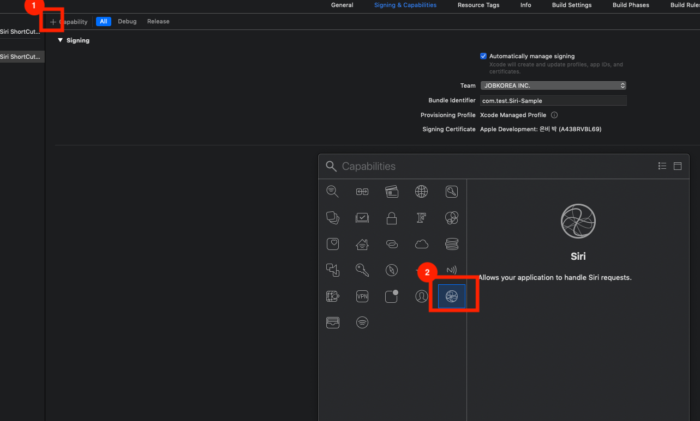
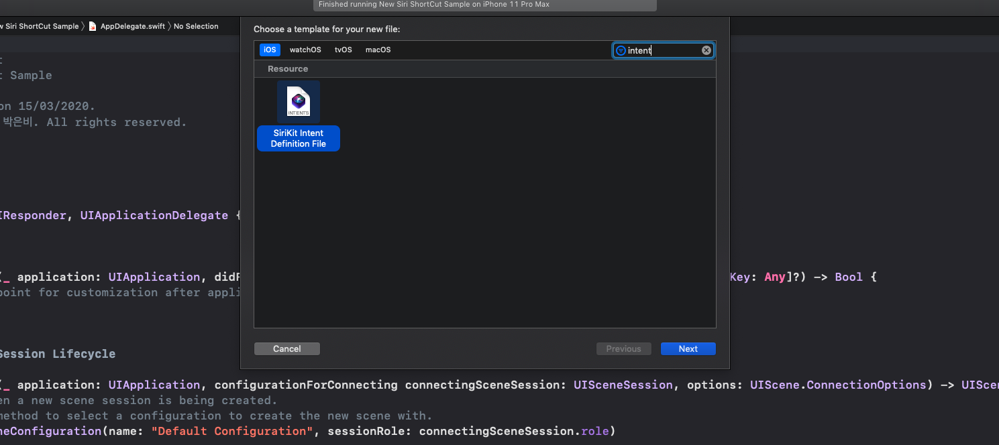
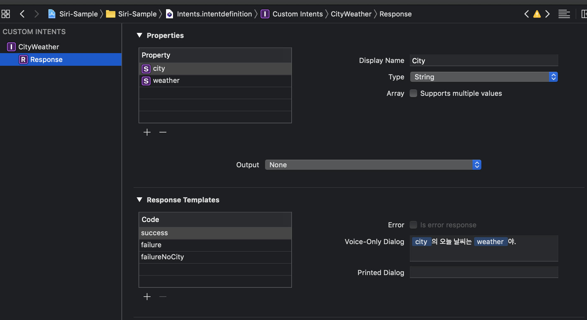
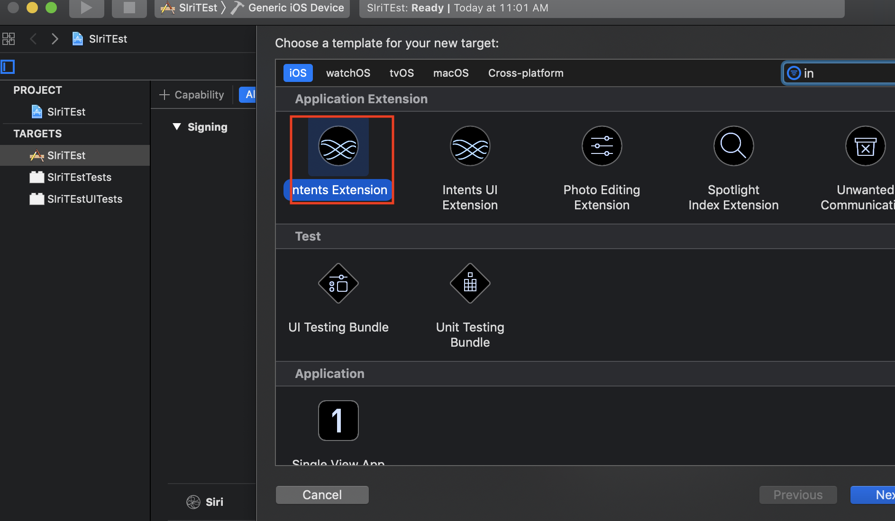
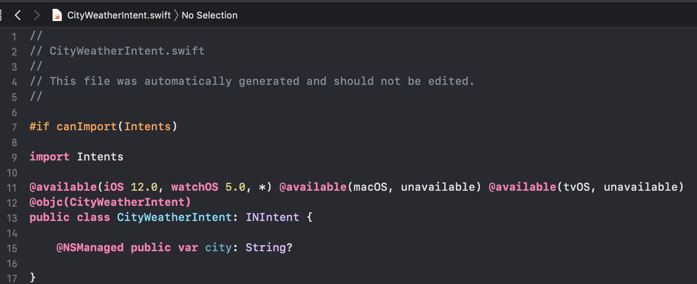
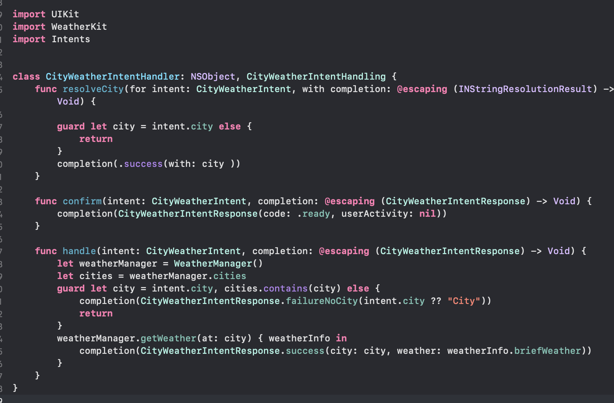
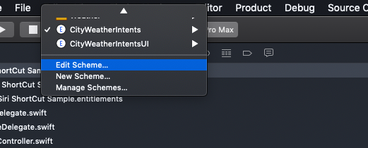
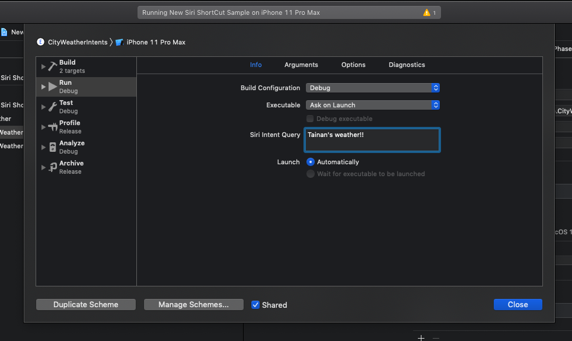
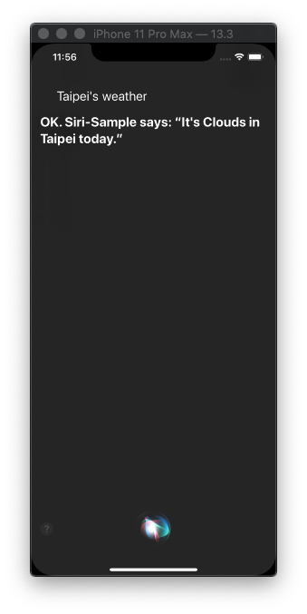

## SiriKit, ShortCut, intents, intents UI
**Siri ShortCut을 위한 샘플앱** 

### [SiriKit](https://developer.apple.com/documentation/sirikit) (iOS 10이상) _Intents, Intents UI Framework_

##### - Intents App Extension

  User(request) -> SiriKit -> APP Task

##### - [Intents FrameWork?](https://developer.apple.com/documentation/sirikit/inintent)

  우리의 앱과 시스템의 커뮤니케이션을 도와주는 프레임워크

##### - [Intents UI FrameWork?](https://developer.apple.com/documentation/sirikit/creating_an_intents_ui_extension)

  Intents를 UI로 커스텀할수있게 만들어줌


## Development

### SiriKit Intents

#### 1) project -> Signing & Capabiliies에서 Siri 사용 추가


#### 2) New File에서 SiriKit Intent Definition File 추가


#### 3) 2번에서 만든 Intent file에서 왼쪽 하단 ‘+’ 버튼을 눌러 내가 원하는 의도대로 request와 response 작성\


#### 4) Project -> 왼쪽 하단 ‘+’ -> Intents Extension 추가


#### 5) Intent Extension을 추가 뒤에 Xcode는 자동으로 CityWeatherIntent.swift를 추가한다.



#### 6) 모든 의도는 CityWeatherIntent.swift를 통하여 처리가 된다. 이를 핸들링 할수 있는 핸들러를 만들어준다.
 

```swift
import UIKit
import WeatherKit
import Intents

class CityWeatherIntentHandler: NSObject, CityWeatherIntentHandling {
    func resolveCity(for intent: CityWeatherIntent, with completion: @escaping (INStringResolutionResult) -> Void) {
        
        guard let city = intent.city else {
            return
        }
        completion(.success(with: city ))
    }
    
    func confirm(intent: CityWeatherIntent, completion: @escaping (CityWeatherIntentResponse) -> Void) {
        completion(CityWeatherIntentResponse(code: .ready, userActivity: nil))
    }

    func handle(intent: CityWeatherIntent, completion: @escaping (CityWeatherIntentResponse) -> Void) {
        let weatherManager = WeatherManager()
        let cities = weatherManager.cities
        guard let city = intent.city, cities.contains(city) else {
            completion(CityWeatherIntentResponse.failureNoCity(intent.city ?? "City"))
            return
        }
        weatherManager.getWeather(at: city) { weatherInfo in
            completion(CityWeatherIntentResponse.success(city: city, weather: weatherInfo.briefWeather))
        }
    }
}
```

#### 7) 이 후 Appdelegate에 Siri를 통해 들어온 의도를 처리할수 있는 [userActivity](https://developer.apple.com/documentation/uikit/uiapplicationdelegate/1623072-application) 내용을 구현함
```Swift
    func application(_ application: UIApplication, continue userActivity: NSUserActivity, restorationHandler: @escaping ([UIUserActivityRestoring]?) -> Void) -> Bool {
        // get the city name
        guard let intent = userActivity.interaction?.intent as? CityWeatherIntent,
            let city = intent.city else {
                return false
        }
        
        // get the dsired view
        let storyboard = UIStoryboard(name: "Main", bundle: nil)
        let vc = storyboard.instantiateViewController(withIdentifier: "WeatherViewController") as! WeatherViewController
        vc.cityName = city
        
        // present the desired view
        let rootViewController = window?.rootViewController as? UINavigationController
        rootViewController?.pushViewController(vc, animated: true)
        
        return true
    }
```


## SiriKit Debugging

#### 1) Intents 선택후 Edit Scheme
 

#### 2) Siri Intent Query에 디버깅시에 시리에게 수행시킬 문자열을 입력
 

#### 3) 디버깅
 


**참고 URL

https://itnext.io/siri-shortcut-tutorial-using-custom-intent-d0f836af5863

https://zeddios.tistory.com/271
